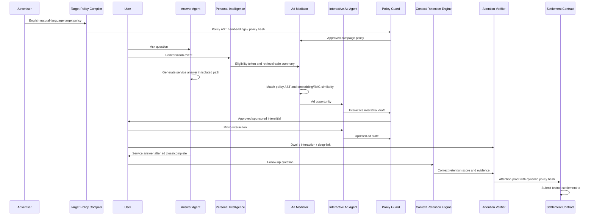

# 01. Logic Spec

- 상태: v0.3 locked
- 작성일: 2026-05-20

## 핵심 명제

Agentic AI 시대의 광고 문제는 추천 자체가 아니라, 서비스 답변과 광고가 같은 언어 형식 안에서 구분 불가능해지는 것이다. 따라서 시스템은 답변 생성과 광고 생성을 분리하고, 광고는 답변 전에 별도의 Interactive Sponsored Interstitial로 표시한다.

## Locked Decisions

- 서비스 언어는 영어다.
- 광고는 답변 전 전면 인터랙티브 광고로 노출한다.
- 광고는 LLM이 현재 사용자 니즈를 반영해 즉석 생성하고, 사용자의 micro-interaction에 실시간 반응한다.
- 답변 Agent와 광고 Agent는 입력, 출력, 로그, 정산 경로를 분리한다.
- 광고주는 영어 자연어로 target policy를 작성한다.
- 자연어 target policy는 내부적으로 policy AST, embedding query, prohibited-sensitive-targeting verdict, policy hash로 컴파일된다.
- AI Provider는 OpenRouter다.
- Context retention은 embedding 기반 RAG와 LLM adjudicator를 적극 활용한다.
- Settlement score는 캠페인별 동적 weight/threshold로 조정 가능하다.
- MVP 정산은 testnet smart contract escrow로 구현한다.
- 사용자 Chat과 광고주 Console은 모두 MVP 필수 범위다.
- Personal Intelligence Store는 platform-private vault로 구현한다.

## 주요 컴포넌트

### 1. Personal Intelligence Store

사용자와 모델의 지속 대화를 통해 형성되는 platform-private 사용자 지능 저장소다.

- 입력: 대화 요약, 사용자의 명시 선호, 태스크 의도, 거부한 광고 카테고리, consent setting
- 출력: 내부 matching feature, privacy-safe eligibility token, retrieval-safe context summary
- 금지: 광고주에게 raw transcript, profile vector, direct identifier 제공

### 2. Answer Agent

사용자 질문에 대한 서비스 답변을 생성한다.

- 입력: 사용자 질문, 대화 맥락, 서비스 지식
- 출력: factual/service answer
- 동작: 광고가 표시되는 동안 답변을 백그라운드에서 생성할 수 있으나, 광고 interaction이 답변의 사실 판단이나 결론을 변경할 수 없다.
- 금지: campaign bid, advertiser target policy, ad creative brief, ad interaction result를 직접 입력받지 않음

### 3. Natural Language Target Policy Compiler

광고주가 영어 자연어로 입력한 target policy를 실행 가능한 내부 표현으로 컴파일한다.

- 입력: advertiser natural-language target brief
- 출력: policy AST, embedding query set, excluded sensitive signals, compiled policy summary, policy hash
- 검증: 민감정보 타겟팅, 차별적 조건, 금지 카테고리, 과도한 개인정보 추론 요청을 차단
- UI: 광고주는 원문 target brief와 compiled summary를 모두 확인한다.

### 4. Ad Pool

광고주가 업로드하는 campaign inventory다.

필수 필드:

- campaign id
- advertiser id
- objective
- product/service summary
- must-include attributes
- prohibited claims
- natural-language target policy
- compiled policy hash
- creative constraints
- allowed interaction templates
- landing/deep-link action
- dynamic settlement policy
- budget and payout rule
- review status

### 5. Ad Mediator

서비스 답변과 독립적으로 광고 기회를 판단한다.

- 입력: anonymized intent context, retrieval-safe context summary, eligibility token, approved ad pools
- 처리: policy AST match, embedding/RAG similarity, ranking, frequency cap, safety filter
- 출력: ad opportunity
- 금지: 답변 텍스트 수정

### 6. Interactive Ad Agent

선택된 ad opportunity를 바탕으로 답변 전 전면 광고를 즉석 생성하고, 사용자의 짧은 interaction에 실시간으로 반응한다.

- 입력: approved creative brief, must-include attributes, current user need summary, allowed interaction template
- 출력: Interactive Sponsored Interstitial spec
- 제한: 광고주가 승인한 claim set 밖의 사실 주장 생성 금지
- 제한: 광고 interaction 결과를 Answer Agent의 factual answer에 주입 금지

Interactive Sponsored Interstitial 필수 요소:

- full-screen sponsored frame
- advertiser name
- generated headline
- generated scripted graphic layout
- one micro-interaction
- CTA
- why-this-ad disclosure
- dismiss/not relevant control

### 7. Policy Guard

광고 생성 전후의 안전 장치다.

- PII leakage 검사
- sponsored labeling 검사
- claim grounding 검사
- prohibited category 검사
- natural-language target policy safety 검사
- frequency cap 검사
- ad interaction isolation 검사
- audit log 생성

### 8. Context Retention Engine

광고 노출 후 사용자의 다음 질문이 광고된 제품/서비스의 속성을 이어받았는지 판단한다.

- 1차: ad claim/attribute와 후속 질문을 embedding으로 검색해 관련 evidence chunk를 구성한다.
- 2차: RAG context를 포함해 LLM이 context retention score와 이유를 판정한다.
- 출력: score, evidence ids, rationale, confidence
- 정산용 로그: raw transcript 대신 hashed event id, evidence summary, classifier version을 저장한다.

### 9. Attention Verifier

광고 노출 후 관심 신호를 계산한다.

- dwell time
- realtime interaction
- context retention
- deep-link verification
- invalid traffic/bot filter
- dynamic settlement eligibility 판단

### 10. Escrow Settlement Layer

광고주 예산을 보관하고, attention proof가 campaign별 dynamic settlement policy를 만족할 때 정산 이벤트를 만든다.

- MVP: EVM-compatible testnet smart contract escrow
- local DB: contract event index와 demo cache
- settlement proof에는 campaign id, event id, signal type, score, timestamp, policy hash, pseudonymous proof만 포함
- on-chain event에는 raw transcript, raw profile, direct user id를 포함하지 않는다.

## 데이터 흐름



## 광고 선택 의사 코드

```ts
type AdDecision = {
  shouldRender: boolean;
  reason: string;
  opportunity?: AdOpportunity;
};

function selectAdOpportunity(input: {
  intentContext: IntentContext;
  retrievalSafeSummary: RetrievalSafeSummary;
  eligibilityToken: EligibilityToken;
  approvedCampaigns: Campaign[];
  userFrequencyState: FrequencyState;
}): AdDecision {
  const candidates = input.approvedCampaigns
    .filter(campaign => campaign.status === "approved")
    .filter(campaign => campaign.compiledTargetPolicy.status === "active")
    .filter(campaign => matchesPolicyAst(campaign.compiledTargetPolicy.ast, input.eligibilityToken))
    .filter(campaign => matchesByEmbeddingRag(campaign.compiledTargetPolicy.embeddingQueries, input.retrievalSafeSummary))
    .filter(campaign => matchesIntent(campaign, input.intentContext))
    .filter(campaign => withinFrequencyCap(campaign, input.userFrequencyState))
    .filter(campaign => hasRemainingEscrowBudget(campaign))
    .filter(campaign => campaign.allowedInteractionTemplates.length > 0);

  const ranked = rankByRelevanceBidAndInteractionFit(candidates, input.intentContext);

  if (ranked.length === 0) {
    return { shouldRender: false, reason: "no_eligible_campaign" };
  }

  return {
    shouldRender: true,
    reason: "eligible_campaign_selected",
    opportunity: buildOpportunity(ranked[0], input.intentContext),
  };
}
```

## Dynamic Attention Score v0.3

Campaign별 `settlementPolicy`가 weight와 threshold를 정한다. 기본값은 아래이며, 광고주는 Console에서 허용 범위 안에서 조정할 수 있다.

```txt
attention_score =
  min(dwell_seconds / dwell_threshold_seconds, 1.0) * dwell_weight
  + realtime_interaction_score * interaction_weight
  + context_retention_score * retention_weight
  + deep_link_score * deeplink_weight
```

기본값:

- dwell weight: 0.25
- realtime interaction weight: 0.20
- context retention weight: 0.30
- deep-link weight: 0.25
- settlement threshold: 0.65

제약:

- weight 합은 1.0이어야 한다.
- threshold 허용 범위는 0.50-0.90이다.
- campaign별 settlement policy는 version과 hash를 가진다.
- smart contract에는 scoreBps, thresholdBps, policyHash, proofHash를 전달한다.

Signal 정의:

- dwell threshold 기본값: 2.5초
- realtime interaction score:
  - 0.0: 광고를 즉시 닫음 또는 interaction 없음
  - 0.5: 광고 내 선택지 클릭, slider 조정, 짧은 입력 등 약한 interaction
  - 1.0: interaction 후 광고 state가 재생성되고 사용자가 그 결과를 확인
- context retention score:
  - embedding/RAG evidence와 LLM rationale을 함께 사용
  - 0.0: 후속 질문이 광고와 무관
  - 0.5: 광고 속성과 약하게 관련
  - 1.0: 광고 제품/서비스 속성을 명시적으로 이어서 질문
- deep-link score:
  - 0.0: 없음
  - 1.0: 광고 컴포넌트 CTA를 눌러 에이전트 후속 태스크 시작

## 불변 조건

- 광고는 답변 전에 표시되지만 답변 본문을 수정하지 않는다.
- 광고 컴포넌트는 항상 sponsored metadata를 가진다.
- 사용자는 광고 카테고리 opt-out을 설정할 수 있다.
- 광고주는 사용자 단위 raw data를 볼 수 없다.
- 자연어 target policy 원문은 광고주가 작성하지만, 활성화는 플랫폼 policy guard의 검수 후에만 가능하다.
- settlement는 attention proof 없이는 발생하지 않는다.
- 전면광고는 사용자가 광고임을 인지할 수 있는 label, disclosure, dismiss/not relevant control을 제공한다.
- smart contract에는 개인정보 원문을 기록하지 않는다.

## Open Decisions

- 없음.
